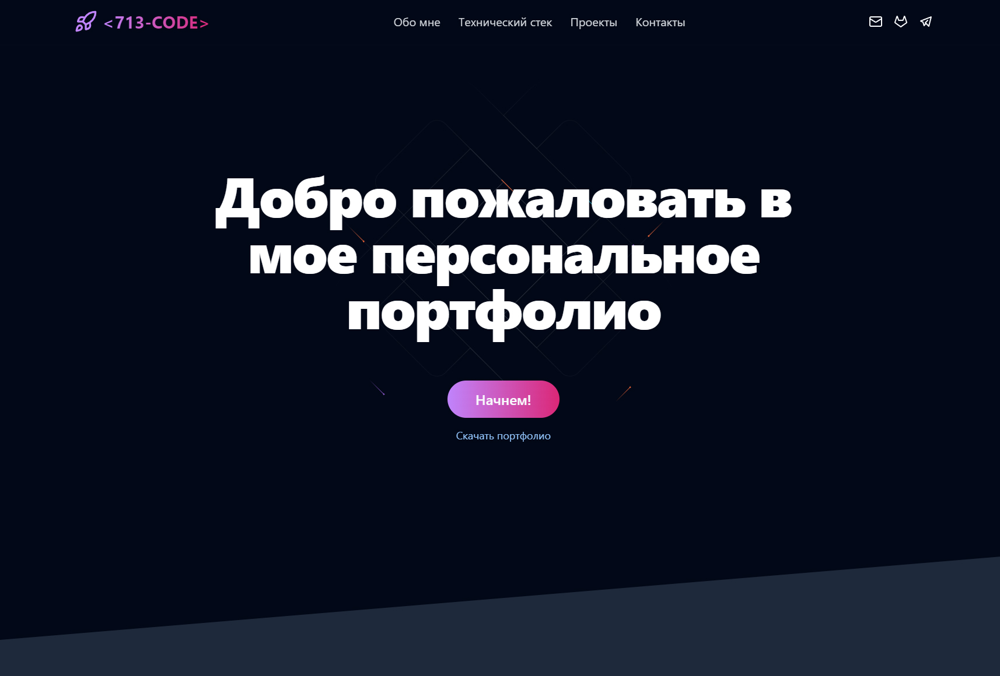

# Portfolio



Это мое персональное портфолио

Здесь я демонстрирую свои проекты и навыки которыми владею в разработке сайтов и приложений. На сайте можно связаться со моною через контактную форму.

Сайт написан с помощью таких технологий как Next.js(14), React, Tailwind, and ShadcnUI

Проект можно посмотреть по ссылке: https://ilya-kiselev-portfolio.vercel.app/

## Getting Started

First, run the development server:

```bash
npm run dev
# or
yarn dev
# or
pnpm dev
# or
bun dev
```

Open [http://localhost:3000](http://localhost:3000) with your browser to see the result.

## env

```bash
BOT_TOKEN = "token" // токен телеграм бота
CHAT_ID = "chat id" // id чата в который бот будет писать
```
